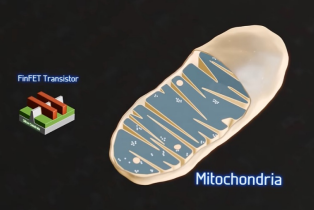
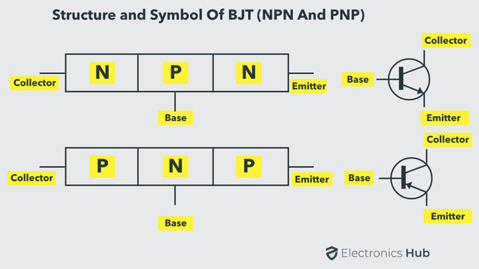

# Transistor

.png)

One of the most numerous electronic components found in computers is the **transistor**.

Whatever device you are using to read this text, be it a smarthphone or a pc, contains a processor composed of millions of microscopic tranisitors.

The M1 Max processor produced in 2021 by the Cupertino company is made from as many as 57 billion miniaturized transistors. An impressive number when we consider that they are all contained in about 400 mm², the size of a fly.

Transistor size comparison with a mitochondrion:




Transistors can work like a switch as well as an amplifier, controlling the flow of electric current through them. 

In the simplest of applications they are used as electrical switches. This behavior is the basis for the realization of fundamental logic gates such as: AND, OR, NOT, which form the building blocks of digital logic. By connecting in specific configurations several transistors, any logic gate can be realized.

There are many types of transistors with similar functionality to each other. The two most widely used are the **BJT** (the one we will analyze) and MOSFET.

### How are bjt made?

BJT (**B**ipolar **J**unctio **T**ransistors) consist of three terminals:

-Emitter (E)

-Base (B), also called the "control terminal".

-Collector (C)


#### Working.

If the base (B) receives an input voltage, which is higher than a threshold voltage (0.6V - 0.7V), the transistor lets current flow between the emitter (E) and the collector (C).


In this way, the BJT acts as a voltage-driven switch. When it is on (ON), it receives voltage at the base, “the switch” closes allowing current to flow through causing the bulb to turn on. On the opposite, if no voltage reaches the base, the transistor behaves as an open switch by cutting off the flow of current. The bulb will result in being turned off.


#### How they are built

Transistors are formed in Silicon or Germanium.
Pure silicon is a semiconductor, meaning that able to conduct electricity and heat better than an insulating material but worse than a conductor.

The bjt transistor is made from 3 regions (N and P) joined together. 


(The base is much thinner than the emitter and collector regions.)

These regions are made through a process called **doping**, which involves introducing impurities into a pure semiconductor to change its electrical properties. In the case of an NPN transistor, the emitter region is typically doped with an element from group V of the periodic table, such as phosphorus. This doping process introduces an excess of electrons into the material, creating an electron concentration in the emitter. The base, on the other hand, is lightly doped with a group III element, such as boron, which creates an electron deficiency thus producing lacunae, or positive charge carriers. Finally, the collector is also doped like the emitter but with a lower concentration of electrons. 
The lacunae in the base area are fewer in number than the free electrons in the emitter.

#### Electron movement
When a voltage is applied between the emitter and the collector, with the base at a lower voltage than the collector, an electric field is created that “attracts” electrons from the emitter to the collector.
The electrons leave from the emitter and are injected into the base, which being very thin and undoped, few electrons combine with the gaps. Most of the electrons continue on their way to the collector, driven by the electric field.

Once in the collector, the electrons create a current that flows through the circuit.

#### Making the circuit
If you have an Arduino (or similar) board, a breadboard a BJT transistor, an LED, a resistor and wires (jumpers) you can make a circuit to see the transistor in action.

In this test we are going to turn the red LED on and off by applying and removing voltage to the base of the transistor. 

The base will be connected to pin 2 of the Arduino board, which will cycle the pin (ON - OFF).

**wiring diagram:**


**code:**

to be uploaded to the arduino board
```cpp
const int ledPin = 2;


const int delayTime = 1000; // 1000 ms = 1 sec

void setup() {
  
  pinMode(ledPin, OUTPUT);
}

void loop() {
  // PIN ON
  digitalWrite(ledPin, HIGH);
  // wait
  delay(delayTime);
  // PIN OFF
  digitalWrite(ledPin, LOW);
  // wait
  delay(delayTime);
}
```

You can also use a simple switch to control the input signal at the base of the transistor without having to use an arduino board.

#### How are they made?
Making such a small device is not at all an easy challenge. Few companies are capable of making processors with billions of these small components. If we are able to do so today, it is only because of the enormous research and development efforts of the past years. The complexity behind the mass production of processors is mind-blowing.

To explore more, this YouTube video clearly describes the entire mechanism of microprocessor production: 
[How are Microchips Made?](https://youtu.be/dX9CGRZwD-w?si=ZWqCJH8OUsNSq-VJ)

Translated with DeepL.com (free version)