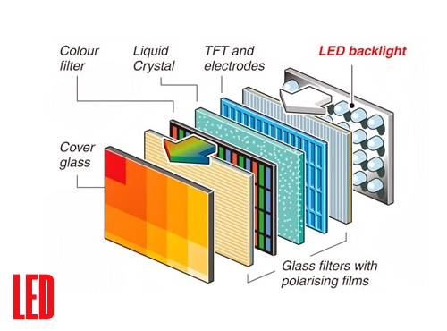

# Display LCD

Il nome "display LCD" deriva dall'inglese Liquid Cristal Display ovvero schermo a cristalli liquidi.

### Che cosa sono i cristalli liquidi?
In termini chimici i cristalli liquidi sono [_composti organici_](./insights/compostiOrganici.md) costituiti da molcole di forma cilindrica (simile ad un bastoncino) o a disco. Queste molecole hanno una fondamentale proprietà fisica, ovvero la capacità di orientarsi (ruotare) quando gli viene applicata una tensione elettrica. In base alla loro inclinazione si può regolare la quantità di luce che li attraversa.

### Come è fatto?

Uno schermo LCD è formato da più strati: 

Il primo, quello più interno non è altro che un pannello che emana luce bianca, serve a retroilluminare lo schermo.

Successivamente, la luce emessa dal pannello di retroilluminazione passa attraverso un filtro polarizzatore. Questo filtro ha la funzione di polarizzare la luce, cioè far passare solo le onde luminose che vibrano in una specifica direzione (verso gli occhi dell'utente). A questo punto, la luce è ancora bianca e deve essere ulteriormente elaborata per creare le immagini che vediamo sullo schermo.

Dopo il polarizzatore, si trova lo strato di cristalli liquidi ai quali verrà applica una tensione tramite l'uso di transistor in modo da modulare la quantità di luce che li attraversa. Questo è lo strato che dà il nome agli schermi (Liquid Crystal Display). Ogni pixel sullo schermo è costituito da un'unità di cristalli liquidi, come già accenato, la loro trasparenza o opacità viene controllata elettricamente per modulare la quantità di luce che passa attraverso ciascun pixel.

A valle dello strato di cristalli liquidi c'è un secondo polarizzatore, disposto in modo perpendicolare rispetto al primo. Solo la luce che ha subito una rotazione nello strato di cristalli riuscirà a passare attraverso questo secondo polarizzatore, il che permette di controllare la luminosità di ciascun pixel.

Infine, per produrre i colori, la luce passa attraverso un filtro a colori. Ogni pixel è suddiviso in sub-pixel rossi, verdi e blu (RGB). Variando la quantità di luce che passa attraverso ciascun sub-pixel, si ottiene la combinazione di colori necessaria per creare l'immagine finale.

Tutti questi strati lavorano insieme in modo sincronizzato, permettendo agli schermi LCD di generare immagini ad alta definizione con un consumo di energia relativamente basso.

